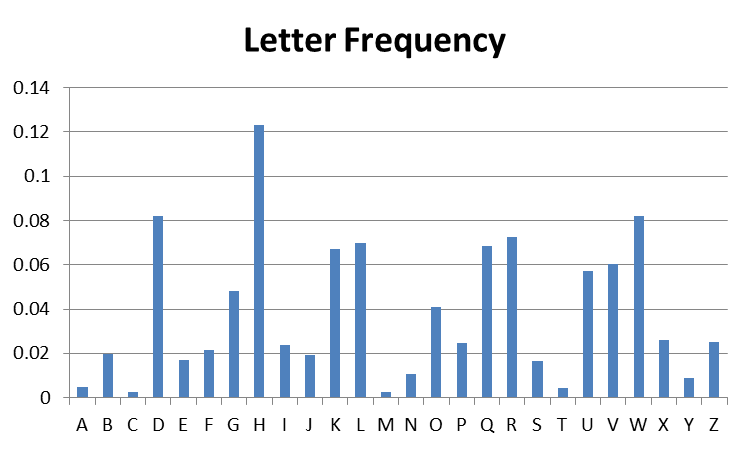

# Classical Cryptography

## Cryptosystems

1. In the English mono-alphabetic cipher (a.k.a substitution cipher), the number of key can be represented in about \_\_\_\_\_\_\_\_\_\_\_\_\_\_\_ bits.

2. The polyalphabetic cipher (a.k.a Vigenere's cipher) is vulnerable to chosen plaintext/ciphertext attacks. What is the most efficient chosen-plaintext attack? What does the attack achieve?

## Frequency analysis

In this discussion, we will preview the first sophisticated approach to cryptanalysis, described by Al-Kindi, born in Basra in what is now Iraq, in 801.

The first graph below shows the letter frequencies for an article that appeared in the Toronto Star. The graph was produced by generating a frequency count of alphabetic characters using a Python program, and then displaying that data using an MS-Excel chart.

The second graph below shows the letter frequencies for a Caesar (shift) cipher encoding of that same article. Caesar certainly simplifies the cryptanalyst's job!

In class we will see that Caesar and its more sophisticated cousin, monoalphabetic cipher, are both vulnerable to frequency 
cryptanalysis. 

3. Based on your understanding of the Caesar cipher, can you guess the key that was used to produce the second graph. 

Vigenere, a polyalphabetic cipher, should be less vulnerable to this attack. Yet, the third graph below shows a graph of letter-frequency for a Vigenere-encoding of the same newspaper article whose letter frequency is displayed above.

4. Based on your understanding of the Vigenere cipher, can you guess the length of the key?

5. What role does a Vigenere password play in frequency profile of the ciphertext?

6. What would the ideal histogram look like, from the point of view of making cryptanalysis as difficult as possible?

## Scale of key robustness

Let's assume that we have a 64 bits machine working at 2GHz (2 x 10^9 cycles/sec). Now, let's imagine that we have a super fast encryption algorithm that can encrypt 64 bits in 1 cycle.

7. Based on a 64 bits message and a 64 bits key, calculate:

    - How many keys per sec can we compute?
    - How many keys per year can we compute?
    - How long would it take to compute all keys?
    - How many computers would you need to crack all keys within a day?

8. Same questions with:

    - 128 bits message and key that now requires 2 cycles to encrypt
    - 256 bits message and key that now requires 4 cycles to encrypt
    - 512 bits message and key that now requires 8 cycles to encrypt
